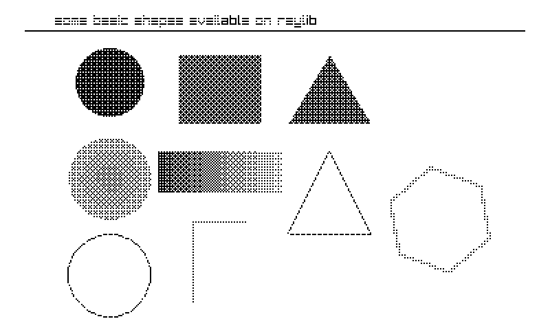

# raylib for Playdate

A raylib fork that runs on the [Panic Playdate](https://play.date/) using the
**rlsw software renderer** — no GPU required. Write ordinary raylib programs
(`InitWindow` … `while (!WindowShouldClose())` … `EndDrawing`) and they render
to the Playdate's 400x240 1-bit LCD via a 4x4 Bayer dither.



## How it works

- **`src/platforms/rcore_playdate.c`** — new raylib platform backend
  (`PLATFORM_PLAYDATE`). The Playdate OS owns the main loop (update callback),
  so the raylib program runs on a green thread; control strictly alternates
  with the update callback, and the game yields once per `EndDrawing()` inside
  `SwapScreenBuffer()`. The same file is the Playdate entry point
  (`eventHandler`).
- **Rendering** — rlgl is compiled with `GRAPHICS_API_OPENGL_SOFTWARE`, so all
  drawing goes through `rlsw.h` into a 16-bit RGB565 framebuffer (the same
  configuration the [ESP32 raylib port](https://components.espressif.com/components/georgik/raylib)
  uses — half the memory and bandwidth of RGBA8888). The dither reads rlsw's
  internal buffer directly (`swGetColorBuffer()`, bottom-up rows — no
  conversion copy) and converts to 1-bit with an ordered Bayer dither on
  luminance, plus a contrast stretch so near-white backgrounds come out clean.
- **Input** — d-pad → arrow keys (and gamepad 0 d-pad), A → `KEY_SPACE`,
  B → `KEY_ENTER`, crank → `GetMouseWheelMove()` (one turn = 1.0). Crank
  specifics live in `pd_raylib.h`: `GetCrankAngle()`, `GetCrankChange()`,
  `IsCrankDocked()`, plus `GetPlaydateAPI()` for the raw C API.
- **Device (ARM) builds** — the same backend compiles for the Cortex-M7 with
  `TARGET_PLAYDATE`: the game context becomes a coroutine on a 128KB static
  stack with a small assembly context switch (r4-r11/lr + s16-s31), time comes
  from `pd->system->getCurrentTimeMilliseconds()`, logs go to
  `pd->system->logToConsole()`, and a handful of newlib syscall/dirent stubs
  satisfy raylib's unused stdio paths. **Not yet tested on hardware.**
- **Audio** — the raudio API is implemented over the Playdate sound engine
  (`src/pd_raudio.c`): `Sound` = AudioSample + SamplePlayer (pdc compiles .wav
  sources to .pda; `LoadSound` strips the extension to find them), `Music` =
  FilePlayer streaming .mp3/.pda. Play/pause/stop/volume/pitch/pan/seek all
  map 1:1; `UpdateMusicStream()` is a no-op (the Playdate streams on its own).
  Stage .wav files in `resources-src/<name>/` (pre-pdc) and .mp3 in
  `resources/<name>/` (post-pdc, raw).
- **Not supported (yet)** — render-texture alpha (R5G6B5 has no alpha
  channel), audio streams/processors, screen sizes other than 400x240.

## Building the examples

Requires the [Playdate SDK](https://play.date/dev/) (`~/Developer/PlaydateSDK`
or set `SDK=`) with `pdc` on `PATH`, clang, and `arm-none-eabi-gcc` for the
device half. Each `.pdx` is universal: it contains both the simulator dylib
and the device `pdex.bin`, so it can be sideloaded onto a Playdate as-is.

```sh
cd playdate
make                        # every example -> <name>.pdx (simulator + device)
make core_basic_window      # one example
make run-core_basic_window  # build + open in the Playdate Simulator
```

## Examples

52 examples: 8 written for the Playdate plus 44 ported from the upstream
`examples/` tree (resized to 400x240; mouse/keyboard interactions remapped to
d-pad/A/B/crank). Examples with assets read them from inside the .pdx via the
platform's pd->file-backed `LoadFileData` callback — the Makefile copies raw
PNGs into the built pdx *after* pdc runs (pdc would otherwise compile them to
.pdi).

| category | examples |
|---|---|
| core | `core_basic_window`, `core_input_buttons`*, `core_input_crank`*, `core_2d_camera`, `core_2d_camera_platformer` (d-pad + A to jump), `core_2d_camera_mouse_zoom` (d-pad pans, crank zooms), `core_3d_camera_mode`, `core_world_screen`, `core_random_values`, `core_basic_screen_manager` (B advances), `core_smooth_pixelperfect` (render textures), `core_3d_camera_first_person` (d-pad walks, crank turns) |
| shapes | `shapes_basic_shapes`, `shapes_logo_raylib_anim`, `shapes_bouncing_ball`, `shapes_easings_ball`, `shapes_easings_rectangles`, `shapes_colors_palette`, `shapes_collision_area` (d-pad moves box B), `shapes_easings_box`, `shapes_easings_testbed` (d-pad picks easings, crank sets duration, B toggles bounded) |
| text | `text_font_default`*, `text_sprite_fonts`, `text_font_loading` (A compares TTF vs BMFont), `text_format_text`, `text_writing_anim`, `text_rectangle_bounds` (A toggles wrap), `text_codepoints_loading` (Japanese TTF codepoints) |
| textures | `textures_image_generation`*, `textures_logo_raylib`, `textures_srcrec_dstrec`, `textures_sprite_animation`, `textures_gif_player` (animated GIF), `textures_image_drawing`, `textures_image_processing` (d-pad selects), `textures_particles_blending` (A cycles blend), `textures_background_scrolling`, `textures_bunnymark` (500 pre-spawned at 50 FPS; hold A for more), `textures_blend_modes` (A cycles) |
| raygui | `raygui_controls_test_suite` (raygui 5.0-dev, one include-path change; d-pad/crank moves the cursor, A clicks) |
| physics | `physac_demo` (Physac header-only 2D physics, PHYSAC_NO_THREADS + manual RunPhysicsStep; A drops polygons, B circles at the cursor) |
| audio | `audio_sound_music` (A plays a sound, B pauses the mp3 stream, crank bends pitch) |
| games | `games_maze_raider`* — showcase game: first-person crawler through procedurally generated mazes (recursive backtracker → GenMeshCubicmap), billboard coin pickups, exit portal, growing levels, crank steering, sounds. Build with `-DMR_DEBUG` for a self-playing autopilot + headless timing/position probe in Data/ |
| models | `models_geometric_shapes`* (crank orbits), `models_billboard_rendering`, `models_cubicmap_rendering`, `models_first_person_maze` (d-pad walks, crank turns), `models_heightmap_rendering`, `models_box_collisions` (d-pad moves player), `models_waving_cubes`, `models_rlgl_solar_system`, `models_orthographic_projection` (A switches projection), `models_loading` (castle.obj), `models_loading_vox` (MagicaVoxel, A cycles), `models_yaw_pitch_roll` (d-pad pitch/roll, crank yaw) |

\* written for this port; the rest are upstream examples with minimal patches.

Skipped upstream categories: `shaders` (rlsw is fixed-function GL 1.1),
`audio` (raudio is not compiled; use `pd->sound`), examples that are
mouse-only or need a resizable window, and effects that depend on an alpha
channel in a render texture (e.g. `textures_fog_of_war`) — the R5G6B5
framebuffer has no alpha, and rlsw requires FBO attachments to match it.

## Lua bindings

raylib can also be driven from **Playdate Lua** (`make raylib_lua.pdx`). The
platform compiled with `PD_RAYLIB_LUA` registers an `rl.*` namespace on
`kEventInitLua` (see `lua/raylib_lua.c`, ~35 functions: drawing lifecycle,
shapes, text, textures, 3D), and `playdate.update()` drives raylib
synchronously — no green thread in this mode; `rl.endDrawing()` dithers and
blits straight into `pd->graphics->getFrame()`. Input uses the regular
`playdate.*` Lua API. `lua/main.lua` is a 36-scene Lua port of the C demo suite (menu-driven; it
boots into an auto-cycle that records per-scene frame times and writes
`perf.json` to the Data dir). All 36 scenes hold a locked 50 FPS in the
simulator, including 500-bunny bunnymark and 225-cube waving cubes; the Lua
binding overhead only shows at extremes (2000 bunnies = ~40 FPS, where the C
version still holds 50). 72 functions are bound, including 2D/3D cameras, blend modes, generated
textures, OBJ/VOX models, billboards, the rlgl matrix stack, loaded fonts
(TTF/BMFont via rl.loadFont + rl.drawTextEx), CPU images with pixel access
(rl.getImageColor for collision), animated GIFs (rl.loadImageAnim +
rl.updateTextureAnim), image-to-mesh generation (rl.genMeshCubicmap/
Heightmap), and render textures (rl.loadRenderTexture + rl.beginTextureMode).

```lua
rl.initWindow(400, 240)
function playdate.update()
    rl.beginDrawing()
    rl.clearBackground(245, 245, 245)
    rl.drawCircle(200, 120, 40, 190, 33, 55)   -- colors are r, g, b
    rl.endDrawing()
end
```

## Headless verification

Builds define `PD_FRAMEDUMP`: every ~2s the platform writes the staged 1-bit
frame (`frame.bin`) and a heartbeat (`pd_status.json`, host/game frame
counters) to the game's Data directory
(`$SDK/Disk/Data/com.plaidate.raylibpd.<name>/`). Convert a dump to PNG:

```sh
python3 tools/frame2png.py "$SDK/Disk/Data/com.plaidate.raylibpd.corebasicwindow/frame.bin" out.png 2
```

A healthy run shows `host_frames ≈ game_slices ≈ frames_shown` advancing at
50/s. Remove `-DPD_FRAMEDUMP` from the Makefile to disable.
